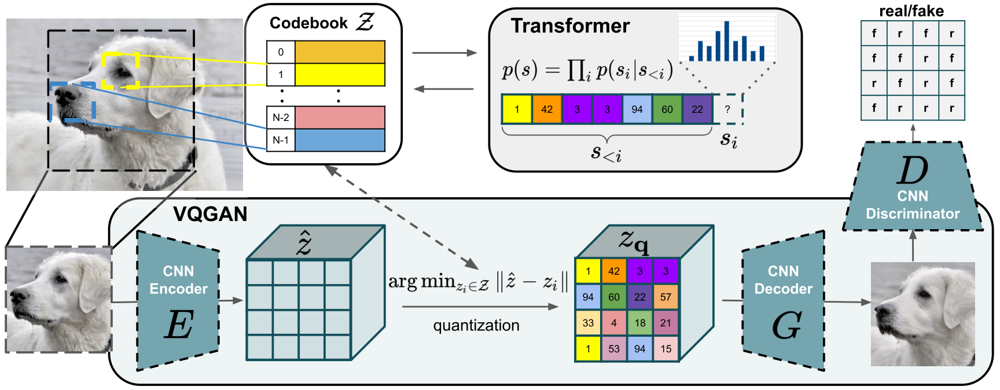

### VQGAN Architecture

1 / 27 / 26
## Transformer Notes:

### Logging
**sample_nopix** - Image generated by the transformer starting from an empty latent space index in other words each index for the latent space z is generated autoregressively starting from scratch.

**sample_half** - Image generated using half of a randomly chosen image from the validation dataset. In other words, take the randomly drawn image, encode it to a matrix of indices from the latent space z, autoregressively generate an image using the transformer and half of the indices.

**sample_det** - (Deterministic sample?) Samples without a starting image but uses top 1 index at each iteration instead of sampling from a multinomial distribution. Should have less variety than "sample_nopix".