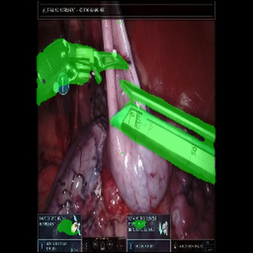
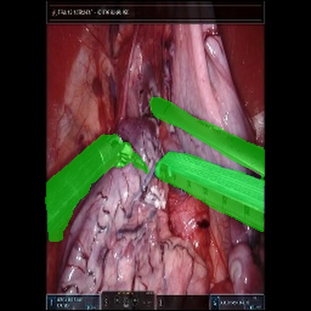
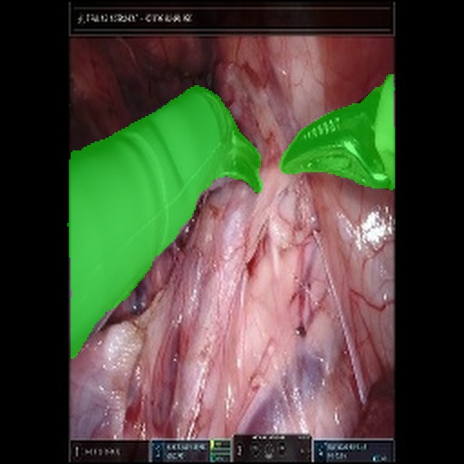
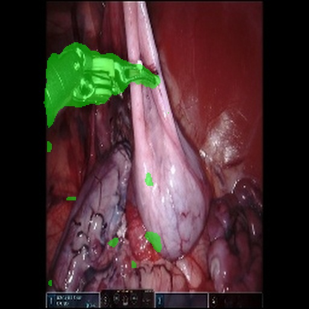

# Generating a synthetic dataset for surgical instrument segmentation with VQDatasetGAN

This project is designed to improve YOLO's performance in segmenting surgical instruments in real-time surgical video.
This is an implementation of the VQGAN-based version of [BigDatasetGAN](https://github.com/nv-tlabs/bigdatasetgan_code).
I rearranged some of the code from [Taiming Transformers](https://github.com/CompVis/taming-transformers) and implemented the segmentation head for VQGAN from BigDatasetGAN based on the segmentation head from BigDatasetGAN.

# Status
I am currently working on improving the image and segmentation mask quality by enhancing the data quality and using transfer learning. I am training VQGAN on a subset of the [SurgVu]([url](https://arxiv.org/abs/2501.09209)) dataset (900k Images), fine-tuning on the [SARAS-MEAD]([url](https://saras-mesad.grand-challenge.org/dataset/)) (23k Images) dataset, and then further fine-tuning on a smaller private dataset specific to Transorbital Robotic Surgery (2k Images). The idea is to train on a large dataset of porcine tissue (SurgVu), then fine-tune on a medium-sized dataset of human tissue (SARAS-MEAD), and then further specialize the model by training on a small dataset of domain-specific human tissue (TORS)

## Example Synthetic Images with segmentation mask overlay

#### SurgVu Images

The VQDatasetGAN model generated these images at 256 x 256 resolution, then upsampled to 512 x 512
